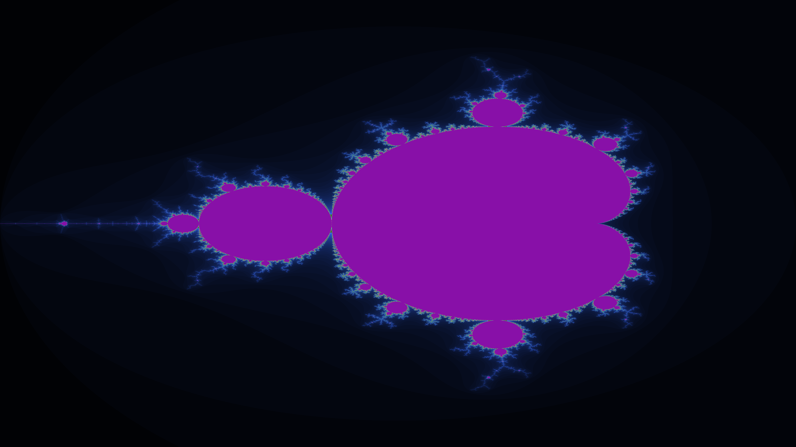

# Mandelbrot & Julia Set Fractal Generator

This project generates stunning Mandelbrot and Julia Set fractals with beautiful color schemes. The project produces high-resolution **16k images** and supports up to **5000 iterations per pixel**. 
It’s built using **Rust** with multithreading, so it’s fast and efficient even when generating high-res images.

## Mandelbrot Set Examples

## Julia Set Examples

